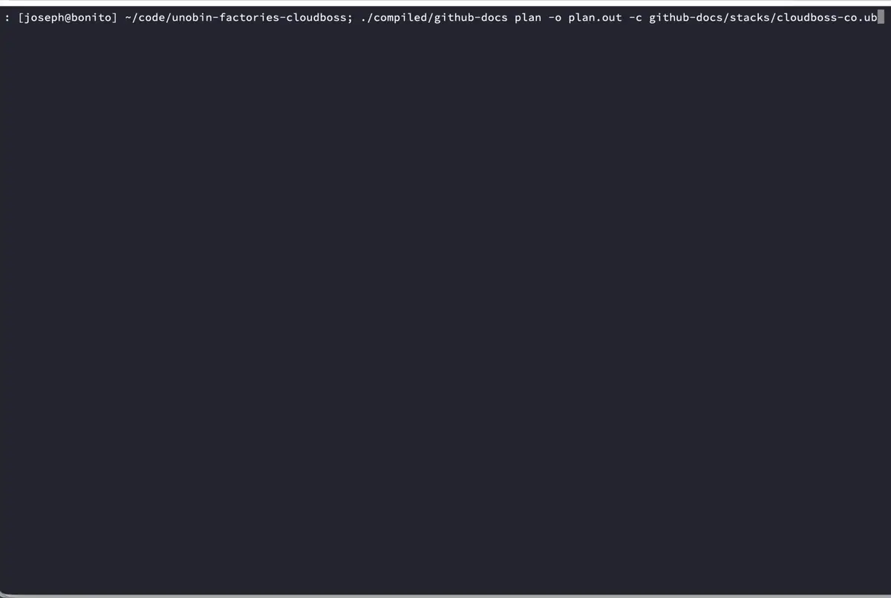

# Unobin

Unobin means _one binary_. It's a tool for infrastructure automation inspired by [Terraform](https://developer.hashicorp.com/terraform), [Ansible](https://docs.ansible.com/projects/ansible/latest/index.html), and others, but unlike those, unobin compiles your code to a standalone binary called a factory.

Read the [full docs](https://cloudboss.co/docs/unobin).



## Quickstart

Install unobin:

```
go install github.com/cloudboss/unobin/cmd/unobin@latest
```

To start a new factory, use the `unobin generate factory` command.

```
unobin generate factory -o appdeploy
```

Now you will have a new directory `appdeploy` (given by `-o`) containing a
`factory.ub` file. Edit `factory.ub` to import libraries and add resources.

When you compile, give it a library path with `--library-path`. This is similar to Go's `module-path` when running `go mod init`. It will normally be the git repo where your library will live.

In the `appdeploy` directory, run:

```
unobin compile -o ./appdeploy-compiled --build --library-path github.com/cloudboss/mystack
```

Now there will be an executable called `./appdeploy-compiled/appdeploy`. You
can use it to generate a stack file from the factory's input schema:

```
./appdeploy-compiled/appdeploy schema template -o dev.ub
```

Edit the generated `dev.ub` if necessary.

Then run plan and apply. A factory cannot apply without first planning.

```
./appdeploy-compiled/appdeploy plan -o plan.json -c dev.ub
./appdeploy-compiled/appdeploy apply plan.json
```

See the [examples](./examples) directory for various example stacks that you can compile and run.

## Editor support

Unobin includes editor support for authoring `.ub` files:

- `unobin lsp` starts the language server used by editors. It provides
  diagnostics, formatting, document symbols, definitions, completions, and hover.
- `unobin lsp --trace trace.json --log server.log` records JSON-RPC traffic and
  server events for debugging. Trace files can include source text.
- Emacs support lives in [`editors/emacs`](./editors/emacs) and uses the
  Tree-sitter grammar plus Eglot registration.
- VS Code support lives in [`editors/vscode`](./editors/vscode) and starts the
  same LSP server with TextMate highlighting.
- Tree-sitter grammar and query sources live in
  [`tree-sitter-unobin`](./tree-sitter-unobin).

The LSP does not fetch dependencies while editing. Run `unobin deps get` or
`unobin deps sync` outside the editor to populate dependency sources and lock
files.

## State inspection and relocation

State commands name entries with a state ref:

```text
<category>.<name>
```

Nested state refs join those same short segments with `/`, such as
`resource.web`, `action.read-back`, or `resource.app/resource.sg`.

Useful state commands:

```text
./app state list -c dev.ub
./app state show resource.web -c dev.ub
./app state pull -c dev.ub > state.json
./app state snapshots list -c dev.ub
./app state move -c dev.ub resource.old resource.web
./app state remove -c dev.ub resource.web
```

`state move` and `state remove` reject legacy qualified refs. Use the short
state ref form.

A factory author can declare idempotent state moves in source:

```ub
factory: {
  state-moves: [
    { from: 'resource.old', to: 'resource.web' },
  ]

  resources: {
    web: aws.instance { name: 'web' }
  }
}
```

A UB composite can declare moves relative to each call site:

```ub
web-cluster: resource {
  state-moves: [
    { from: 'resource.sg', to: 'resource.web-sg' },
  ]

  resources: {
    web-sg: aws.security-group { name: input.name }
  }
}
```

A composite boundary move also relocates matching children below that boundary:

```ub
factory: {
  state-moves: [
    { from: 'resource.web', to: 'resource.app' },
  ]

  resources: {
    app: net.cluster { name: 'app' }
  }
}
```

Use explicit child moves when a child address also changes. A plan prints actual
state moves before resource changes:

```text
State moves:
  resource.old -> resource.web
```

## Dependency projects and import packages

A dependency project is a versioned directory with `project.ub` or `go.mod` at
its root. A package import may name any directory below that project:

```ub
imports: {
  helloer: 'example.com/repo//ub/helloer'
}
```

The project file names the owning project, not every package below it:

```ub
project: {
  requires: {
    'example.com/repo': { version: 'v1.2.3' }
  }
}
```

`unobin deps get` adds projects. If a repository subdirectory has its own
`project.ub` or `go.mod`, it is a project and may be added directly:

```ub
project: {
  requires: {
    'example.com/repo//library-c': { version: 'v1.2.3' }
  }
}
```

The repository root uses ordinary semver tags such as `v1.2.3`. A project in a
subdirectory uses tags prefixed by that project path, such as `library-c/v1.2.3`
or `libs/core/v1.2.3`. Package paths below the project do not change the tag.

A nested `project.ub` is a project boundary. `unobin deps sync` for an ancestor
project does not scan files under that nested project. Run
`unobin deps sync -p library-c` to manage `library-c/project.ub` and
`library-c/project-lock.ub`.

Use a project id plus a replacement for local development against a nested
project:

```ub
project: {
  requires: {
    'example.com/repo//library-c': { version: 'v1.2.3' }
  }
  replace: { 'example.com/repo//library-c': './library-c' }
}
```

Relative imports may only target source governed by the same nearest
`project.ub`.

`unobin deps sync` manages UB projects only. If the nearest marker is `go.mod`,
use Go commands for that module instead.

A `project.replace` key is a project id. When a direct import has an exact
replacement and no real version yet, `unobin deps sync` records the reserved
project replacement sentinel `v0.0.0-unobin-replaced`. The replacement must be exact; a
parent project replacement does not satisfy a nested project's reserved version.
Replaced projects are not written to `project-lock.ub`.

Go projects keep module identity separate from package imports. A `.ub` file may
import a Go package below a module, but generated `main.go` imports the package
path while generated `go.mod` requires and replaces the module path read from
the selected project's `go.mod`:

```text
source import:     example.com/lib//fs
generated import:  example.com/lib/fs
generated require: example.com/lib v1.2.3
```

Go modules follow Go's major-version path rule. A selected `v2.0.0` module must
use a module path ending in `/v2`; `v3.0.0` must use `/v3`, and so on. UB
project ids do not add `/vN` for major versions.

## Benefits of Unobin

### No Dependencies

An unobin factory includes the runtime and dependencies. It's like having your modules, providers, and Terraform itself all included in one executable.

### Consistent Interface

All factories have the same command line arguments with automatically generated help. If you know how to run one, you know how to run all of them.

### Reproducible

The goal is: if it works on my machine, then it works on your machine. You don't need to do extra steps or install anything before you can deploy your infrastructure. Just download the factory and run it.

### Input Validation

All factories validate their inputs against a schema and will not run if the inputs do not pass validation.

## Comparison with Other Tools

|                      | Unobin | Ansible    | Chef   | Terraform  |
|:--------------------:|:------:|:----------:|:------:|:----------:|
|No server             |&check; |            |        |&check;     |
|Local mode            |&check; |optional    |&check; |&check;     |
|Syntax                |Unobin  |YAML+Jinja2 |Ruby    |HCL         |
|Works on my machine   |&check; |maybe       |maybe   |maybe       |
|Works on your machine |&check; |maybe       |maybe   |maybe       |
